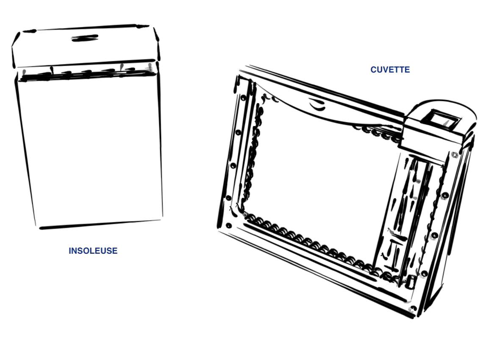

# AETZBOX
### DIY Mobile PCB Etching KIT

## The Idea 
Build a portable / mobile PCB etching workstation that fulfills these criteria
* waterproof
* able to etch 100x160mm double sided boards with 8mil precision
* low cost.  total bill of materials should not exceed 150 CHF
* diy approach, mostly laser cut plexi and easily sourceable materials
* fits in a RAKO Box

Some guiding ideas
* use very little but always fresh chemicals 
* good heat management: etching has to be done at 45-50 degrees celsius, developer has to be kept at >20 degrees as well (in my workshop, temperatures can easily drop below 16 degrees and developing is a pain).
* all material and chemicals travel in the box. liquid waste can travel in the box as well until it can properly disposed of.
* should be easy to clean. no electronics exposed to moisture. 
* as few as possible switches and electrical contacts exposed to the harsh etching environment
* self illuminating

## More Info
https://wiki.sgmk-ssam.ch/index.php/EtchingBox